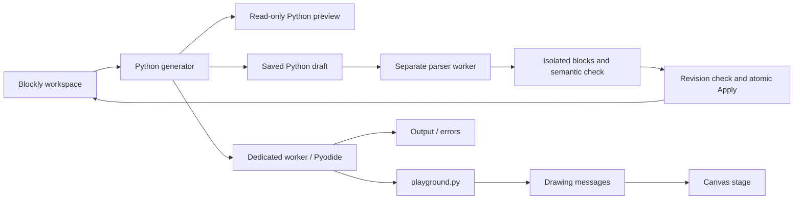

# Architecture

## Current flow

The browser UI is TypeScript, built by Vite. The learner's program executes as Python through Pyodide. Blockly's workspace is the committed program. The editable Python draft is saved separately with its exact source and base revision; applying it validates a candidate before changing the blocks. Run and exports validate an active draft first, so invalid text cannot silently execute the prior blocks. Generated files remain derived, read-only inspection views.

## Module contracts

The [blocks and Python bridge](blocks-python-bridge-plan.md) is implemented and [audited](blocks-python-bridge-audit.md). `src/bridge/parse_python.py` inspects source through CPython AST parsing and compilation checks without executing it. A separate, cancellable worker uses the pinned local runtime; the wire protocol preserves numeric literals as text and translates AST/token positions into UTF-16 text offsets. Native/compiler error positions are normalized separately because their column conventions differ. The execution worker and its running project remain independent.

`src/bridge/converter.ts` captures a project before awaiting the parser and constructs a separate candidate. `core-converter.ts` maps literals, expressions, variables, collections and control flow into ordinary editable blocks. It compiles and reparses the candidate, accepting it only if the syntax trees agree under the explicit normalizations in `ast.ts`. This check preserves execution order and rejects dropped imports, coercions and unsupported rewrites. An exact generated-source path retains the entire original project, including legacy block shapes, disabled code and loose drafts. The candidate API never mutates the live workspace.

`draft-state.ts` registers saved `pythonBridge` metadata. Project envelope version 2 preserves exact draft/checkpoint source, a SHA-256 authored-project revision and explicit recovery entries; version-1 projects still load. The language version remains 19. The existing local-storage key remains readable for migration. Recovery holds up to 20 entries and stops before exceeding that limit or the 16 MB project limit; it never silently evicts an older source.

`controller.ts` captures the whole authored project, including layout, module pins and scene assets, before conversion and compares it again after asynchronous work. Draft metadata is excluded from the revision. Typing, cancellation, a newer Apply or disposal invalidates earlier results. `transaction.ts` installs a validated candidate as one Blockly Undo event, rolls back failed deserialization, and preserves the previous active program in saved source recovery. Undo/Redo retains text typed after Apply; its unchanged base revision makes an intervening block change an explicit conflict.

`editor.ts` provides the main-file textarea, generated-file selector, diagnostics, Apply/cancel, exact source downloads and recovery controls. Tab leaves the editor; Ctrl/Command+Enter applies. Native textarea newline normalization is translated when selecting diagnostic spans, while untouched CRLF source remains exact in storage/downloads. Pinned module source is inspected separately. Applying stops the prior run and refreshes the authored scene. Compilation caching excludes draft state, and runtime errors identify a newer unapplied draft separately from the running program.

`language-converter.ts` resolves function-local bindings before body conversion and maps named/dynamic calls, non-capturing lambdas, awaits, project/sprite/kind events and pinned modules. Plain function definitions may be ordered within their initial declaration region; imports, startup actions and registrations retain execution order. Compile-time globals preserve the exact set of globally assigned names. `reconcile.ts` preserves matching block/scope IDs, layout, dormant shadows and inactive drafts. Function renames use the original parsed definition only when the match is unambiguous. Calls keep pinned module identities and immutable source files.

`library-catalog.ts` describes every current pen, scene, input, game and sound block with its argument order, await requirement and statement/value form. `library-converter.ts` validates literal dropdowns against the actual blocks and resolves literal asset references against captured scene data. `scene-bootstrap.ts` recognizes the exact generated scene load and optional motion activation; the full semantic comparison still checks those statements. Metadata remains outside Python and is preserved in project and source exports. Reconciliation retains typed asset references where unchanged Python literals are ambiguous. The only accepted comprehension is Blockly's exact generated three-or-more-item text join, retaining its eager item evaluation and isolated loop variable.

`src/blocks/index.ts` and `src/blocks/core/` register blocks and supply the toolbox and example. `src/language/compiler.ts` validates active code and returns one compilation artifact for preview, execution, and export. Only the Program body and top-level function/handler definitions generate source; loose blocks are inactive drafts. Definition ordering is independent of screen placement. Handlers register after startup initialization in their saved delivery order. Generation retains Blockly's expression support with project-owned overrides for core semantics.

The compilation artifact contains source, diagnostics, statement line spans, a revision ID, language version, and sequential/event execution mode. Temporary emission markers carry block identity through indentation and definition hoisting; they are removed before Python is displayed or executed. Runtime errors use the artifact captured for that run, so editing during execution cannot map an old error onto new code. Run and Export refresh the artifact from the current model, even before deferred Blockly notifications arrive; duplicate notifications for the same snapshot retain its revision.

`src/language/functions.ts` adapts the shareable-procedures model to Python scopes. Function and parameter IDs are independent of displayed names; call input names include parameter IDs. Parameters carry their own case-sensitive Python names instead of deriving them from Blockly's shared backing variables. Project variables and function-local variables use separate variable types; `py_get`/`py_set` and scoped loops resolve these symbols directly. `src/language/variables.ts` supplies case-sensitive lookup for Python variable scopes, so `count` and `Count` remain distinct. Functions emit `global` only for explicitly selected project bindings, with diagnostics for conflicting spellings in a function.

Signature edits are atomic undo events. Their snapshots preserve parameter identities and attached argument blocks, including removed arguments that become recoverable drafts. Undo/redo notifies preview and autosave after the model is restored. `src/language/editor.ts` provides the forms and dynamic toolbox entries.

The same procedure model owns explicit async metadata and each handler's event name, delivery order, and single payload parameter. Handler bodies reuse function-local scope. Async calls generate `await`; calling them from a synchronous context is a preflight error. There are no implicit async conversions or loop yields. `src/language/event-editor.ts` provides handler creation, editing, copying, deletion, and immediate order changes. Definition creation and placement, signature changes, and order changes are grouped for Undo. Copied handlers receive fresh scoped identities and append to the delivery order.

`src/language/clipboard.ts` makes copy/paste the identity-changing boundary. Copied definitions receive new function, parameter, local, and block IDs; internal references and self-recursive calls follow those IDs. External references retain their IDs and remain unresolved when unavailable, even if the destination has similarly named symbols. Copies are validated in a temporary workspace and applied as one undo group. Ordinary save/load and undo retain identities. Full block serialization carries owned locals and symbol labels for clipboard transport and recovery; it does not allocate new identities by itself.

`src/project/index.ts` wraps Blockly JSON in a versioned project envelope. Import is checked in a separate headless workspace before replacing the current project. Single-stack legacy projects are wrapped in Program; multiple stacks require an explicit ordering review. Browser autosave preserves invalid/incompatible stored content for recovery instead of overwriting it with the starter. A page-exit save captures the current model so immediate reload after an edit or Undo/Redo cannot lose a deferred notification; recovery mode still keeps autosave paused.

Language version 2 added scoped symbols and ID-based calls; version 3 added the collection palette and durable copy metadata; version 4 added handler and async metadata; version 5 added pinned modules; version 6 added synchronous function references and dynamic calls; version 7 added lambda scope and parameter identities. Versions 1–6 remain readable, and missing async/module metadata preserves prior behavior. `src/project/migrate-functions.ts` converts version-1 procedures, calls, parameter references, variables, and loop targets. Legacy function assignments preserve their project bindings; only actual parameters become parameter symbols. This prevents old global updates from silently turning into local assignments. Blockly's registered procedure serializer owns the model; cached signatures on blocks retain the shape of unresolved calls and support definition restoration.

`src/blocks/core/function-values.ts` defines dynamic statement/value calls and their positional argument mutator. Named references reuse stable procedure IDs; imported references retain module pins. They emit native Python function objects and calls. Module dependency analysis follows references as well as direct calls. Signature edits update reference labels, while dynamic arguments keep their positional order. Async and handler references are rejected. See the [function-value contract](function-values.md).

`src/blocks/core/lambdas.ts` and `src/language/lambdas.ts` own expression lambdas, scope IDs, ordered parameter IDs, and atomic parameter edits. `lambda-editor.ts` supplies creation and parameter forms. Body reads bind to their own lambda parameters; unsupported enclosing/project captures and async bodies are diagnosed. Explicit synchronous helper references remain allowed when no intervening name shadows them. Duplication remaps anonymous scopes and their reads, including nested lambdas; project/module loading validates distinct scope IDs.

`src/language/serialization.ts` restores global Undo recording and event groups even when Blockly deserialization throws. Its workspace wrapper also finishes the pinned loader's render/cache cleanup on failure. Project import, module validation/inspection, and clipboard preflight use this boundary.

`src/language/modules.ts` owns pinned definitions and project-local namespace bindings through a registered workspace serializer and atomic undo events. `module-format.ts` exports local function dependency closure and validates imported files in isolated workspaces. Imported definitions remain immutable; call blocks retain pin, binding, function, and parameter identities. Different revisions can coexist under distinct aliases, while mismatched contents for an existing pin are rejected. Module dependencies are acyclic; function recursion is ordinary Python. `module-editor.ts` provides import/export, namespace editing, removal, and read-only block/source inspection. The [module contract](reusable-modules.md) records exact format, scope, and recovery behavior.

Compilation includes generated module files and filename-to-pin metadata alongside the main source. Each module compiles in its own scoped workspace. Project globals and startup/handler roots are excluded from module definitions. The worker passes the captured source dictionary to `execution.py`, whose scoped import hook creates ordinary Python modules with generated filenames. This keeps native collection identity and async calls while preserving module traceback locations. Source maps distinguish module definitions even when block IDs overlap across imported workspaces; the main UI reports the module location and highlights the local caller.

`src/blocks/core/collections.ts` defines native list/dictionary operations and the dictionary-pair editor. Collection values remain ordinary Python objects: aliases and parameter passing preserve identity; indexing is zero-based with negative list indices; errors remain Python exceptions. Shallow copying shares nested objects, and dictionary defaults use Python's eager argument evaluation. List and dictionary mutators preserve removed expressions as editable drafts, including shadow values, and keep retained values attached during reordering. Saved projects contain constructors and references, never a snapshot of the Python heap.

Comparison blocks retain differently typed operands so Python decides equality or raises a runtime ordering error. Repeat loops use a reserved helper name to avoid overwriting learner parameters or locals.

`src/runtime/runner.ts` owns one worker per run, ignores stale messages, and terminates the worker on completion, failure, Stop, or timeout. Startup has a 60-second limit; sequential execution has a separate 10-second limit. A new run creates a fresh interpreter. Projects with active handler roots select event mode, which has a responsiveness watchdog and bounded, acknowledged host input. The test-event form is enabled only after readiness; idle event sessions remain live until Stop or failure.

`src/runtime/python.worker.ts` loads self-hosted Pyodide assets, writes the bundled Python library into the virtual filesystem, registers `_playground_host`, and executes the generated source through `execution.py`. The execution helper compiles it as `program.py` and returns exception type, message, frames, and traceback. An explicit `started` lifecycle event begins the execution deadline. Output is limited to 20,000 characters. Dependencies are fixed; there is no automatic package installation from learner imports.

`src/runtime/events.py` implements the cooperative session. The worker writes it as `_playground_events.py`; `playground.events` resolves the current session lazily. Module initialization and the awaited session entry are separate. Handlers dispatch FIFO in registration order, waits explicitly yield, payloads are independent bounded snapshots, and a failure stops the whole session. Dispatch failures retain the originating emit locations separately from Python traceback frames. The editor uses those origins to identify the send block, subject to the same captured-revision check as other failures. The [runtime record](event-runtime-prototype.md) documents the shared limits and tested behavior.

`src/runtime/playground.py` implements the initial pen API:

| API | Behavior |
| --- | --- |
| `pen.move(steps)` | Move along the current heading and draw if the pen is down |
| `pen.turn(degrees)` | Rotate clockwise |
| `pen.color("#RRGGBB")` | Select a line color |
| `pen.up()` / `pen.down()` | Disable / enable drawing while moving |

Coordinates start at the center of a 480 × 320 stage. Positive x is right; positive y is up. Heading zero points right. Drawing is clipped to the canvas; it does not wrap at edges. Nonfinite values and coordinates outside ±1,000,000 are rejected. A run is limited to 10,000 movement/turn commands.

`src/runtime/protocol.ts` describes messages and validates drawing values. The stage retains bounded commands and redraws at most once per animation frame. This is final-state drawing with incremental updates when browser scheduling permits, not a timed animation engine.

## Sprite scenes and input

`src/scene/model.ts` defines the authored scene, image assets, runtime render snapshots and input boundary. `state.ts` registers the `pythonScene` workspace serializer and atomic Undo events. `editor.ts` provides sprite selection/properties, direct placement, costume import and focus-aware input. The authored model is separate from the renderer's runtime copy.

Language version 8 added scene metadata; version 9 added motion/sensing/dialogue blocks and saved rotation style; version 10 added backdrop and authored-frame operations; version 11 added sprite pen/stamps and sprite/stage effects; version 12 added handler sprite targets, initial data and pixel sensing; version 13 added motion profiles, kinds and kind handlers; version 14 added named worlds, tilemaps, cameras and sprite world membership; version 15 added game state and presentation; version 16 added sounds, songs and audio blocks; version 17 added questions, elapsed timers, color sensing and saved touch mappings; version 18 added optional watcher definitions; version 19 adds unary plus/minus expression blocks for the Python bridge while continuing to read projects from versions 1–18 and pinned modules from versions 5–18. Scene blocks emit ordinary method calls and reserved import aliases; reusable modules receive authored objects through parameters. Compilation captures scene data with source/maps. The worker writes `scene.json`, and generated startup loads it before the learner's program. Source export includes that same file and embedded image data.

`src/scene/raster.ts` implements bounded bitmap editing independently of the UI. `assets.ts` draws original built-ins and repairs authored references when custom assets are deleted. `art-editor.ts` keeps draft pixels, stroke history and selection/overlay state separate from committed scene metadata; saving uses one atomic scene Undo event. Stable asset IDs support shared editing, independent duplication and ordered frame references. The same editor manages backdrops, frame timing and cancellable previews. Scene imports decode all images before replacing current work. The [artwork contract](artwork-and-backdrops.md) details limits, recovery and event behavior.

`src/runtime/scene.py` owns native Python sprite objects, transforms, overlap bounds, lifetimes and explicit awaited glide/costume animation. Host messages render state snapshots in `src/stage.ts`; the host never writes runtime coordinates back into project metadata. New workers reconstruct initial state. Keyboard/pointer input uses the existing acknowledged, bounded event channel, with a distinct input message that updates held-key/pointer state before dispatch. Pointer movement coalesces under worker pressure without discarding button transitions. Rotation geometry is shared conceptually by the Python bounds and canvas rendering; dialogue uses separate transient render messages and an accessible text caption.

See the [sprite contract](sprites-stage-input.md) for coordinates, input semantics, supported operations, asset limits, and tests.

`appearance-editor.ts` edits saved pen/effect metadata through atomic scene Undo. `effects.ts` validates effect records and implements original bitmap color/geometry transforms. The stage caches at most 16 filtered assets and invalidates them on scene reset. Sprite movement emits pen segments, and stamp messages capture complete appearance snapshots. A drawing layer sized to the active tilemap (480 × 320 on the base stage) composes turtle and sprite marks in delivery order, beneath live sprites. Rendering processes bounded batches and retains unresolved stamps until image decoding completes. Clear/reset drops pending marks as well as raster pixels. The [pen/effects contract](sprite-pen-effects.md) records exact behavior, numeric units and resource limits.

## Source export

**Export Python** exports generated Python with an explicit dependency note. A project with modules or a scene exports a ZIP containing the exact main/module source files, a filename-to-pin manifest, a README, and scene.json with image assets when present; a project without modules retains its single Python file. Playground APIs require our runtime library and host. An event export also notes that its host must initialize the module and then await the event session. These downloads do not package the runtime/host or editable blocks. **Export playable** packages these dependencies and the editable blocks using the standalone delivery path described below.

## Execution and security boundaries

Workers keep Python off the UI thread and can be terminated even during an infinite loop. They are **not** a complete sandbox for untrusted projects: Pyodide exposes browser APIs, and a worker on the application origin can have access to origin resources. Python limits are convenience controls, not adversarial enforcement.

This scaffold has no authentication or private data and is intended for locally authored examples. Before loading untrusted code or introducing shared projects, design an isolated execution origin with a minimal, validated message protocol; keep account credentials and private storage out of it; restrict network and host capabilities; and apply resource limits outside the Python program. Server-side Python, if ever added, requires a separate isolation design.

Do not implement arbitrary Python security through string filters or a list of forbidden imports. Do not assume a Web Worker or WebAssembly alone protects application data.

## Later language work

- Design lexical closure capture, nested named definitions, and async function values separately if needed. The current synchronous reference/dynamic-call/expression-lambda subset is implemented.
- Extend existing statement-level error mapping with expression spans and, later, execution stepping.
- Extend the implemented sprite/input event sources with future device integrations on the same cooperative scheduling and cancellation contract.
- Define a supported Python subset before implementing text → blocks. Preserve unsupported text without silently rewriting or discarding it.
- If bidirectional editing needs a shared syntax tree, introduce it with the subset specification; the drawing scaffold does not need a bespoke compiler framework yet.

## Verification

TypeScript checks catch integration and message-shape mistakes. Unit tests exercise real Blockly generation, escaping, runtime message validation, and worker lifecycle. Native Python tests exercise geometry, input errors, and command limits using a fake host bridge. Browser tests run the production build with real Pyodide, check canvas output, cancellation/restart, and source download.

Native Python tests alone do not prove browser compatibility; the Pyodide browser test is required before changes to the bridge or loader are considered verified. The [core language audit](core-language-completion-audit.md) links the full requirement coverage and verification record.

Sprite-owned handlers use `src/runtime/behaviors.py` to route registered events into instance invocations within the same event session. A Python context variable carries the current sprite across awaits; task ownership supports intentional cancellation on destruction. Update invocations coalesce per handler/instance, and the shared scene clock supplies update/contact events. Worker and stage use `src/scene/sensing.ts` for visible-pixel sensing, with costume rasterization and the existing effects transform. See the [behavior contract](sprite-behaviors-and-sensing.md) for scheduling, data, limits and sampling semantics.

`src/runtime/physics.py` advances fixed-step automatic motion from the shared scene clock. It sweeps moving rectangles against authored solid sprites, resolves wall/edge impacts, applies controls/acceleration/drag and destroys expired/offstage bodies. Kind handlers reuse the instance router. A motion-bearing scene or motion helper enables event execution even without user handlers; compilation discovers imported helper requirements before validating the caller. Scene render snapshots include current motion for the velocity watcher, while authored profiles stay in saved scene data. See the [game motion contract](game-motion-and-collisions.md).

`world.ts` validates saved maps/cameras and handles resize/clamping; `world-editor.ts` authors maps, profiles and named worlds through the scene serializer. `worlds.py` owns fresh runtime tilemaps, scene entry, local-sprite reconstruction and camera state. Solid-cell candidates feed the existing swept collider without creating sprite instances for tiles. Transitions defer self-cancellation until the destination is installed; internal routed events carry a world generation to reject stale deliveries. The stage culls tile rendering to the viewport, pans sprites/ink/dialogue and converts pointer coordinates back to world space. See the [worlds contract](worlds-tilemaps-and-cameras.md).

`src/runtime/game.py` owns score, lives, countdown and terminal game state. A bounded game command carries snapshots to the accessible DOM HUD in `src/scene/game.ts`; camera-independent UI stays separate from canvas pixels and sensing. Cosmetic bursts render on the stage with a finite lifetime and capacity. `EventSession.finish()` uses private terminal control flow, cancels tasks/services and returns successful completion. Replay in `src/main.ts` creates a new worker from the immutable captured compilation. An active Python draft must match the exact draft and authored project validated by that run; otherwise the UI directs the learner to Run Python or explicit discard. Run validates and applies an active draft before capturing a compilation. Game helpers propagate their event-session requirement through module dependencies. See the [game presentation contract](game-state-and-presentation.md).

### Audio ownership and completion

The Python Sounds library owns channel settings and playback identities; the main-thread SoundPlayer owns Web Audio buffers and nodes. Worker audio commands are validated separately from scene rendering. Ended/error acknowledgements return to the originating worker and resolve the exact Python waiter. Runner disposal stops all audio; sprite destruction stops its channel. The sound editor uses a separate preview context and draft state. Saved assets are canonical embedded mono WAV or editable note scores. See [sound and music](sound-and-music.md) for numeric bounds, browser activation, recording cleanup, persistence and tests.

### Questions, elapsed time and virtual input

Python owns one future per question and monotonic elapsed time; the main-thread Questions host owns the FIFO form. Runner replacement scopes replies to the originating worker and clears the form during disposal. HeldKeys aggregates physical and virtual input sources before using the existing bounded key protocol. Color queries use a synchronous worker raster updated before outgoing scene/draw messages, keeping Python queries current even before the next animation frame. The raster composes the visible camera viewport without the querying sprite, HUD or other transient presentation. See [questions, timers, touch and color](questions-timers-and-touch.md) for cancellation, rendering, persistence and verification.

### Editor navigation and live inspection

Scene palettes are grouped by purpose and default to the selected authored sprite. Navigation uses stable IDs for artwork and handler shortcuts. Optional saved watcher definitions are captured with the run; a worker timer reads bounded Python previews at most ten times per second and sends changed results separately from scene commands. Preview formatting never invokes learner-defined representation methods. Normal completion publishes a final snapshot, while Stop retains the most recent result. The large-stage modal moves the existing DOM hosts and canvas, preserving worker identity and logical coordinates. See [editor and play workflow](editor-and-play-workflow.md) for state phases, input/focus behavior and evidence.

## Standalone player

`src/player/main.ts` composes the shared `Stage`, `PythonRunner`, `SoundPlayer`, `Questions`, `GameView` and `PlayInput` without Blockly or editor state. The worker receives an explicit runtime URL rooted at the player document, so an extracted player works beneath a nested HTTP path. The editor continues using its configured runtime base. `src/scene/play.css` supplies shared stage, HUD, question, touch and watcher presentation. Both hosts use the same keyboard aggregation, pointer capture/coalescing, focus reset and touch mappings.

`vite.player.config.ts` produces a relative-path player bundle. `scripts/prepare-player.mjs` adds the pinned Pyodide files, Python library sources, loopback-only standard-library launcher and dependency notices, then records SHA-256 digests and sizes. `src/project/playable-export.ts` captures the current compilation and editable snapshot before awaiting any downloads, verifies a bounded resource manifest, and compresses the captured project with the complete runtime. Cancellation, network failures, digest mismatch and timeout leave the project intact. The player validates its execution manifest and scene and loads source files as text; error tracebacks refer to the included source files and `source-map.json` retains block mappings. See [portable playback](portable-playback.md) for files, run instructions and independent-browser evidence.
