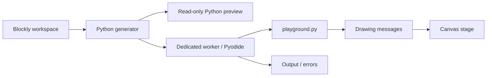

# Architecture

## Current flow

The browser UI is TypeScript, built by Vite. The learner's program executes as Python through Pyodide. Blockly's workspace is the source of truth in this version. Generated source is derived data, never a second independently edited copy.

## Module contracts

`src/blocks/index.ts` and `src/blocks/core/` register blocks and supply the toolbox and example. `src/language/compiler.ts` validates active code and returns one compilation artifact for preview, execution, and export. Only the Program body and top-level function/handler definitions generate source; loose blocks are inactive drafts. Definition ordering is independent of screen placement. Handlers register after startup initialization in their saved delivery order. Generation retains Blockly's expression support with project-owned overrides for core semantics.

The compilation artifact contains source, diagnostics, statement line spans, a revision ID, language version, and sequential/event execution mode. Temporary emission markers carry block identity through indentation and definition hoisting; they are removed before Python is displayed or executed. Runtime errors use the artifact captured for that run, so editing during execution cannot map an old error onto new code. Run and Export refresh the artifact from the current model, even before deferred Blockly notifications arrive; duplicate notifications for the same snapshot retain its revision.

`src/language/functions.ts` adapts the shareable-procedures model to Python scopes. Function and parameter IDs are independent of displayed names; call input names include parameter IDs. Parameters carry their own case-sensitive Python names instead of deriving them from Blockly's shared backing variables. Project variables and function-local variables use separate variable types; `py_get`/`py_set` and scoped loops resolve these symbols directly. `src/language/variables.ts` supplies case-sensitive lookup for Python variable scopes, so `count` and `Count` remain distinct. Functions emit `global` only for explicitly selected project bindings, with diagnostics for conflicting spellings in a function.

Signature edits are atomic undo events. Their snapshots preserve parameter identities and attached argument blocks, including removed arguments that become recoverable drafts. Undo/redo notifies preview and autosave after the model is restored. `src/language/editor.ts` provides the forms and dynamic toolbox entries.

The same procedure model owns explicit async metadata and each handler's event name, delivery order, and single payload parameter. Handler bodies reuse function-local scope. Async calls generate `await`; calling them from a synchronous context is a preflight error. There are no implicit async conversions or loop yields. `src/language/event-editor.ts` provides handler creation, editing, copying, deletion, and immediate order changes. Definition creation and placement, signature changes, and order changes are grouped for Undo. Copied handlers receive fresh scoped identities and append to the delivery order.

`src/language/clipboard.ts` makes copy/paste the identity-changing boundary. Copied definitions receive new function, parameter, local, and block IDs; internal references and self-recursive calls follow those IDs. External references retain their IDs and remain unresolved when unavailable, even if the destination has similarly named symbols. Copies are validated in a temporary workspace and applied as one undo group. Ordinary save/load and undo retain identities. Full block serialization carries owned locals and symbol labels for clipboard transport and recovery; it does not allocate new identities by itself.

`src/project/index.ts` wraps Blockly JSON in a versioned project envelope. Import is checked in a separate headless workspace before replacing the current project. Single-stack legacy projects are wrapped in Program; multiple stacks require an explicit ordering review. Browser autosave preserves invalid/incompatible stored content for recovery instead of overwriting it with the starter. A page-exit save captures the current model so immediate reload after an edit or Undo/Redo cannot lose a deferred notification; recovery mode still keeps autosave paused.

Language version 2 added scoped symbols and ID-based calls; version 3 added the collection palette and durable copy metadata; version 4 added handler and async metadata; version 5 added pinned modules; version 6 added synchronous function references and dynamic calls; version 7 adds lambda scope and parameter identities. Versions 1–6 remain readable, and missing async/module metadata preserves prior behavior. `src/project/migrate-functions.ts` converts version-1 procedures, calls, parameter references, variables, and loop targets. Legacy function assignments preserve their project bindings; only actual parameters become parameter symbols. This prevents old global updates from silently turning into local assignments. Blockly's registered procedure serializer owns the model; cached signatures on blocks retain the shape of unresolved calls and support definition restoration.

`src/blocks/core/function-values.ts` defines dynamic statement/value calls and their positional argument mutator. Named references reuse stable procedure IDs; imported references retain module pins. They emit native Python function objects and calls. Module dependency analysis follows references as well as direct calls. Signature edits update reference labels, while dynamic arguments keep their positional order. Async and handler references are rejected. See the [function-value contract](function-values.md).

`src/blocks/core/lambdas.ts` and `src/language/lambdas.ts` own expression lambdas, scope IDs, ordered parameter IDs, and atomic parameter edits. `lambda-editor.ts` supplies creation and parameter forms. Body reads bind to their own lambda parameters; unsupported enclosing/project captures and async bodies are diagnosed. Explicit synchronous helper references remain allowed when no intervening name shadows them. Duplication remaps anonymous scopes and their reads, including nested lambdas; project/module loading validates distinct scope IDs.

`src/language/serialization.ts` restores global Undo recording and event groups even when Blockly deserialization throws. Its workspace wrapper also finishes the pinned loader's render/cache cleanup on failure. Project import, module validation/inspection, and clipboard preflight use this boundary.

`src/language/modules.ts` owns pinned definitions and project-local namespace bindings through a registered workspace serializer and atomic undo events. `module-format.ts` exports local function dependency closure and validates imported files in isolated workspaces. Imported definitions remain immutable; call blocks retain pin, binding, function, and parameter identities. Different revisions can coexist under distinct aliases, while mismatched contents for an existing pin are rejected. Module dependencies are acyclic; function recursion is ordinary Python. `module-editor.ts` provides import/export, namespace editing, removal, and read-only block/source inspection. The [module contract](reusable-modules.md) records exact format, scope, and recovery behavior.

Compilation includes generated module files and filename-to-pin metadata alongside the main source. Each module compiles in its own scoped workspace. Project globals and startup/handler roots are excluded from module definitions. The worker passes the captured source dictionary to `execution.py`, whose scoped import hook creates ordinary Python modules with generated filenames. This keeps native collection identity and async calls while preserving module traceback locations. Source maps distinguish module definitions even when block IDs overlap across imported workspaces; the main UI reports the module location and highlights the local caller.

`src/blocks/core/collections.ts` defines native list/dictionary operations and the dictionary-pair editor. Collection values remain ordinary Python objects: aliases and parameter passing preserve identity; indexing is zero-based with negative list indices; errors remain Python exceptions. Shallow copying shares nested objects, and dictionary defaults use Python's eager argument evaluation. List and dictionary mutators preserve removed expressions as editable drafts, including shadow values, and keep retained values attached during reordering. Saved projects contain constructors and references, never a snapshot of the Python heap.

Comparison blocks retain differently typed operands so Python decides equality or raises a runtime ordering error. Repeat loops use a reserved helper name to avoid overwriting learner parameters or locals.

`src/runtime/runner.ts` owns one worker per run, ignores stale messages, and terminates the worker on completion, failure, Stop, or timeout. Startup has a 60-second limit; sequential execution has a separate 10-second limit. A new run creates a fresh interpreter. Projects with active handler roots select event mode, which has a responsiveness watchdog and bounded, acknowledged host input. The test-event form is enabled only after readiness; idle event sessions remain live until Stop or failure.

`src/runtime/python.worker.ts` loads self-hosted Pyodide assets, writes the bundled Python library into the virtual filesystem, registers `_playground_host`, and executes the generated source through `execution.py`. The execution helper compiles it as `program.py` and returns exception type, message, frames, and traceback. An explicit `started` lifecycle event begins the execution deadline. Output is limited to 20,000 characters. Dependencies are fixed; there is no automatic package installation from learner imports.

`src/runtime/events.py` implements the cooperative session. The worker writes it as `_playground_events.py`; `playground.events` resolves the current session lazily. Module initialization and the awaited session entry are separate. Handlers dispatch FIFO in registration order, waits explicitly yield, payloads are independent bounded snapshots, and a failure stops the whole session. Dispatch failures retain the originating emit locations separately from Python traceback frames. The editor uses those origins to identify the send block, subject to the same captured-revision check as other failures. The [runtime record](event-runtime-prototype.md) documents the shared limits and tested behavior.

`src/runtime/playground.py` implements the initial pen API:

| API | Behavior |
| --- | --- |
| `pen.move(steps)` | Move along the current heading and draw if the pen is down |
| `pen.turn(degrees)` | Rotate clockwise |
| `pen.color("#RRGGBB")` | Select a line color |
| `pen.up()` / `pen.down()` | Disable / enable drawing while moving |

Coordinates start at the center of a 480 × 320 stage. Positive x is right; positive y is up. Heading zero points right. Drawing is clipped to the canvas; it does not wrap at edges. Nonfinite values and coordinates outside ±1,000,000 are rejected. A run is limited to 10,000 movement/turn commands.

`src/runtime/protocol.ts` describes messages and validates drawing values. The stage retains bounded commands and redraws at most once per animation frame. This is final-state drawing with incremental updates when browser scheduling permits, not a timed animation engine.

## Source export

The current button exports generated Python with an explicit dependency note. A project with modules exports a ZIP containing the exact main/module source files, a filename-to-pin manifest, and a README; a project without modules retains its single Python file. Playground APIs require our runtime library and host. An event export also notes that its host must initialize the module and then await the event session. These downloads do not package the runtime/host or editable blocks. A future runnable distribution should include those dependencies, assets, and a documented launcher.

## Execution and security boundaries

Workers keep Python off the UI thread and can be terminated even during an infinite loop. They are **not** a complete sandbox for untrusted projects: Pyodide exposes browser APIs, and a worker on the application origin can have access to origin resources. Python limits are convenience controls, not adversarial enforcement.

This scaffold has no authentication or private data and is intended for locally authored examples. Before loading untrusted code or introducing shared projects, design an isolated execution origin with a minimal, validated message protocol; keep account credentials and private storage out of it; restrict network and host capabilities; and apply resource limits outside the Python program. Server-side Python, if ever added, requires a separate isolation design.

Do not implement arbitrary Python security through string filters or a list of forbidden imports. Do not assume a Web Worker or WebAssembly alone protects application data.

## Later language work

- Design lexical closure capture, nested named definitions, and async function values separately if needed. The current synchronous reference/dynamic-call/expression-lambda subset is implemented.
- Extend existing statement-level error mapping with expression spans and, later, execution stepping.
- Build future sprite/device event sources on the verified cooperative scheduling and cancellation contract.
- Define a supported Python subset before implementing text → blocks. Preserve unsupported text without silently rewriting or discarding it.
- If bidirectional editing needs a shared syntax tree, introduce it with the subset specification; the drawing scaffold does not need a bespoke compiler framework yet.

## Verification

TypeScript checks catch integration and message-shape mistakes. Unit tests exercise real Blockly generation, escaping, runtime message validation, and worker lifecycle. Native Python tests exercise geometry, input errors, and command limits using a fake host bridge. Browser tests run the production build with real Pyodide, check canvas output, cancellation/restart, and source download.

Native Python tests alone do not prove browser compatibility; the Pyodide browser test is required before changes to the bridge or loader are considered verified. The [core language audit](core-language-completion-audit.md) links the full requirement coverage and verification record.
