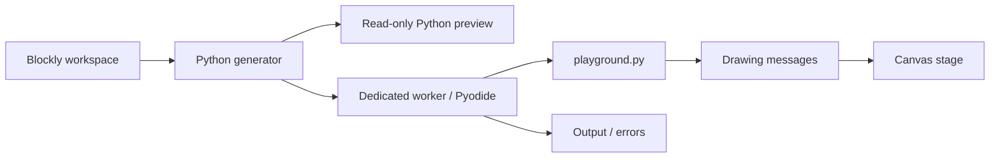

# Architecture

## Current flow

The browser UI is TypeScript, built by Vite. The learner's program executes as Python through Pyodide. Blockly's workspace is the source of truth in this version. Generated source is derived data, never a second independently edited copy.

## Module contracts

`src/blocks/index.ts` registers Blockly's standard blocks and our pen blocks, supplies the toolbox and example, and exports `generatePython(workspace)`. Custom blocks add a single import through Blockly's generator definitions. Generation uses Blockly's expression precedence and escaping support.

`src/runtime/runner.ts` owns one worker per run, ignores stale messages, and terminates the worker on completion, failure, Stop, or timeout. Startup has a 60-second limit; execution has a separate 10-second limit. These are prototype defaults, not final teaching semantics. A new run creates a fresh interpreter.

`src/runtime/python.worker.ts` loads self-hosted Pyodide assets, writes the bundled Python library into the virtual filesystem, registers `_playground_host`, and executes the generated source. Output is limited to 20,000 characters. Dependencies are fixed; there is no automatic package installation from learner imports.

`src/runtime/playground.py` implements the initial pen API:

| API | Behavior |
| --- | --- |
| `pen.move(steps)` | Move along the current heading and draw if the pen is down |
| `pen.turn(degrees)` | Rotate clockwise |
| `pen.color("#RRGGBB")` | Select a line color |
| `pen.up()` / `pen.down()` | Disable / enable drawing while moving |

Coordinates start at the center of a 480 × 320 stage. Positive x is right; positive y is up. Heading zero points right. Drawing is clipped to the canvas; it does not wrap at edges. Nonfinite values and coordinates outside ±1,000,000 are rejected. A run is limited to 10,000 movement/turn commands.

`src/runtime/protocol.ts` describes messages and validates drawing values. The stage retains bounded commands and redraws at most once per animation frame. This is final-state drawing with incremental updates when browser scheduling permits, not a timed animation engine.

## Source export

The current button exports generated Python with an explicit dependency note. The file requires `playground.py` and `_playground_host`; ordinary desktop Python cannot execute it alone. A future project bundle should include source, library version, assets, a manifest, and a documented browser or desktop host. Do not describe current source downloads as standalone programs.

## Execution and security boundaries

Workers keep Python off the UI thread and can be terminated even during an infinite loop. They are **not** a complete sandbox for untrusted projects: Pyodide exposes browser APIs, and a worker on the application origin can have access to origin resources. Python limits are convenience controls, not adversarial enforcement.

This scaffold has no authentication or private data and is intended for locally authored examples. Before loading untrusted code or introducing shared projects, design an isolated execution origin with a minimal, validated message protocol; keep account credentials and private storage out of it; restrict network and host capabilities; and apply resource limits outside the Python program. Server-side Python, if ever added, requires a separate isolation design.

Do not implement arbitrary Python security through string filters or a list of forbidden imports. Do not assume a Web Worker or WebAssembly alone protects application data.

## Later language work

- Add a versioned project format around Blockly serialization before persistence and sharing.
- Preserve block IDs and map generated source ranges back to blocks for errors and stepping.
- Prototype event ordering, cooperative scheduling, cancellation, and yielding before sprites and broadcasts become stable APIs.
- Define a supported Python subset before implementing text → blocks. Preserve unsupported text without silently rewriting or discarding it.
- If bidirectional editing needs a shared syntax tree, introduce it with the subset specification; the drawing scaffold does not need a bespoke compiler framework yet.

## Verification

TypeScript checks catch integration and message-shape mistakes. Unit tests exercise real Blockly generation, escaping, runtime message validation, and worker lifecycle. Native Python tests exercise geometry, input errors, and command limits using a fake host bridge. Browser tests run the production build with real Pyodide, check canvas output, cancellation/restart, and source download.

Native Python tests alone do not prove browser compatibility; the Pyodide browser test is required before changes to the bridge or loader are considered verified.
